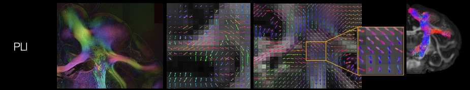
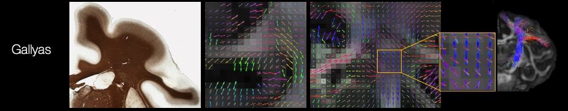
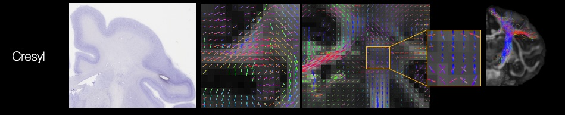

Different microscopy contrasts
===================================

PLI
--------
PLI estimated the primary fibre orientation based on the birefringence of myelinated axons with a resolution of at the micro-meter per pixel. Maps of fibre orientation within the microscopy plane (in-plane angles) were used as input for the hybrid dMRI-PLI tractography. 

We observe U-shaped fibres, also known as short arcuate fibres, connecting different gyri with a consistent curving structure in the through-plane orientation, the most challenging orientation for the hybrid method.

Gallyas Silver staining
--------
Histology slides with Gallyas silver staining (myelin) were digitised at a spatial resolution of 0.28 µm/pixel. 2D structure tensor analysis of the stained sections (using a Gaussian kernel with sigma=10 pixels) was used to estimate the fibre orientations for each microscopy pixel. The structure tensor output can be input directly to the hybrid method and reconstruct the hybrid Gallyas-dMRI fibre orientations. 

Cresyl Vilot staining
--------
Similar to the Gallyas, 2D structure tensor analysis of the stained sections was used to estimate the fibre orientations for each microscopy pixel.

  
