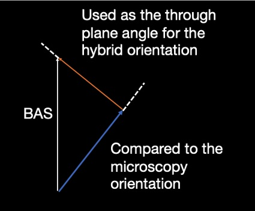

Different microscopy contrasts
===================================

PLI
--------
PLI estimated the primary fibre orientation based on the birefringence of myelinated axons with a resolution of at the micro-meter per pixel. Maps of fibre orientation within the microscopy plane (in-plane angles) were used as input for the hybrid dMRI-PLI tractography. 

Gallyas Silver staining
--------
2D structure tensor analysis of the stained sections was used to estimate the fibre orientations for each microscopy pixel.

Cresyl Vilot staining
--------
Similar to the Gallyas, 2D structure tensor analysis of the stained sections was used to estimate the fibre orientations for each microscopy pixel.

  
