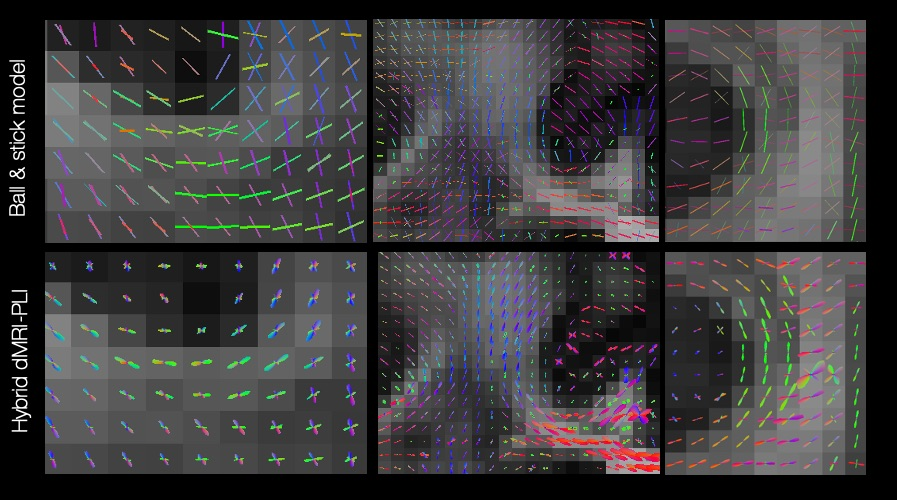
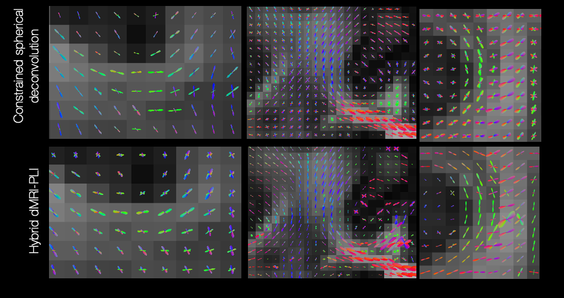
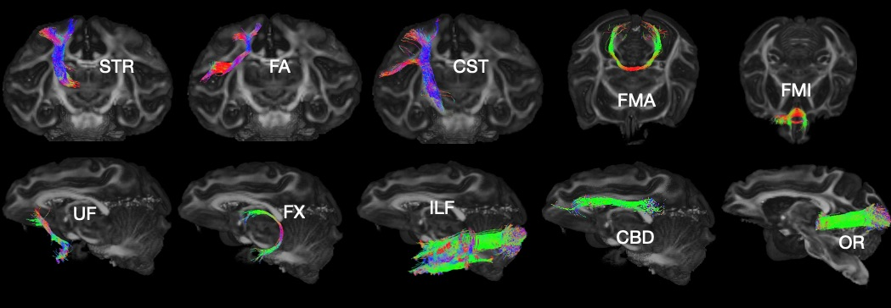

Hybrid Orientation Evaluation
===================================

Comparison of Hybrid Orientation with other fibre orientation reconstruction method
--------

The hybrid orientation was compared to the orientations obtained from the dMRI data using the ball and stick model (BAS) which assumed the dMRI data can be described by a ball compartment and stick compartments.

Second, a comparison to the Constrained Spherical Deconvolution method was implemented. The hybrid dMRI-PLI FOD agreed with the fibre orientation obtained from BAS and CSD in dMRI data from coronal, sagittal and transverse views near the cortex. 

Tractography
--------

We reconstruct fibre bundles spanning the whole brain. The XTRACT (https://fsl.fmrib.ox.ac.uk/fsl/fslwiki/XTRACT) toolbox was employed to define seed and target regions of interest (ROIs) for a total of 42 tracts, comprising association, commissural, and projection fibres. The results further demonstrate that our method is applicable to the major white matter tracts and can reconstruct tracts spanning the whole macaque brain.

Ten example tracts generated from the hybrid tractography at 0.6mm are illustrated including the superior thalamic radiation (STR), frontal aslant (FA), corticospinal tract (CST) in the coronal view, forceps major (FMA), forceps minor (FMI) in the axial view, uncinate fasciculus (UF), fornix (FX), inferior longitudinal fasciculus (ILF), cingulum subsection: dorsal (CBD), optic radiation (OR) in the sagittal view (b). 
