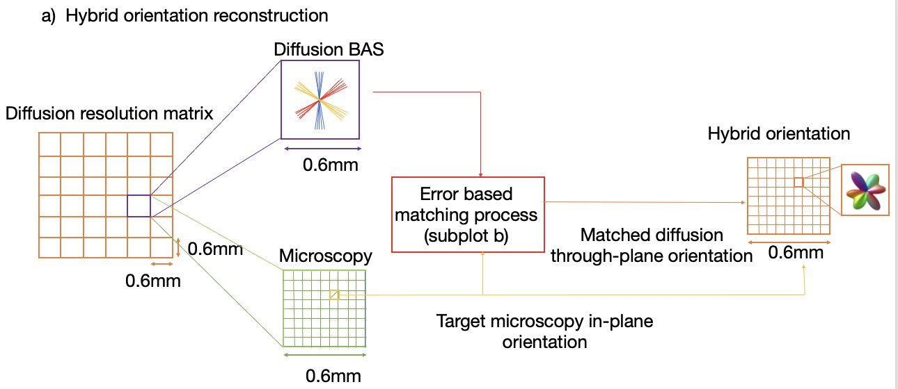
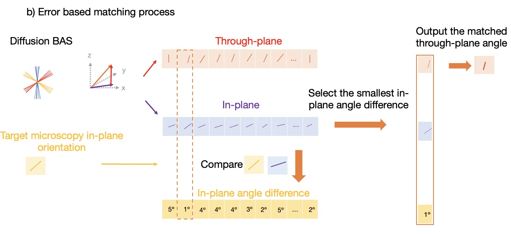
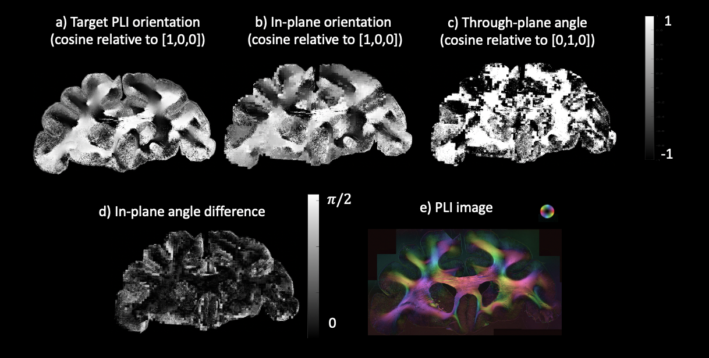

Overview of the hybrid orientation approach
--------
The hybrid orientation method combines microscopy and dMRI for high-resolution 3D fibre orientation. The dMRI data was analysed with the ball and stick model (BAS) at 0.6mm. Each microscopy pixel and the diffusion BAS within the same voxel were used in an error based matching process. This process calculated the matched diffusion through-plane orientation, which was combined with the 2D microscopy orientation to reconstruct the hybrid orientation.

Error based matching process
--------
The diffusion BAS and microscopy in-plane orientation were used as inputs. The 3D BAS orientation was decomposed into the through-plane angle and in-plane angle by projecting onto the microscopy plane. This process was repeated for multiple fibre populations (≤ 3) with 50 orientation samples per population of the BAS. The in-plane angle was compared to the target microscopy in-plane orientation by quantifying the angle difference. We selected the BAS sample with the smallest in-plane angle difference and determined the matched through-plane angle. 

Here, we show the in-plane, through-plane angle projecting from the BAS samples which show spatial variations. We also calculated the angle difference maps between the target PLI orientation and the most similar BAS fibre orientation which has been projected onto the microscopy plane.

