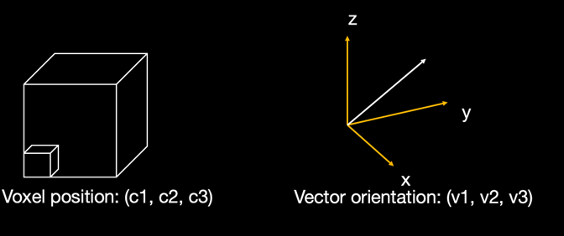

dMRI microscopy hybrid orientation reconstruction tutorial
===================================

Diffusion MRI orientation
--------
First, the diffusion MRI orientation is provided by the Ball and stick model using FSL. The signal decay of the diffusion is modelled by an isotropic compartment (Ball) and multiple restricted compartments for fibre orientation (stick). 

| merged_th<i>samples: samples from the distribution on theta
| merged_ph<i>samples: samples from the distribution on phi
| merged_f<i> samples: samples from the distribution on anisotropic volume fraction

The threshold of anisotropic volume fraction for three fibre population is set at 0.05 and fibre having lower volume fraction than this threshold will be removed. Details of ball and stick model output can be found https://fsl.fmrib.ox.ac.uk/fsl/fslwiki/FDT/UserGuide.

Other diffusion model can also be used such as the constrained spherical deconvolution in mrtrix generating the white matter fibre orientation distribution function (fODF). The peaks will be first extracted from the fODF and the discrete fibre orientation can be input into the hybrid model. 

Microscopy orientation
--------
First, the microscopy orientation has been registered to the dMRI space with FSL tool tirl (https://fsl.fmrib.ox.ac.uk/fsl/fslwiki/TIRL/UserGuide). The voxel coordinate for each microscopic pixel is described by x, y, z coordinates in the diffusion mri space. The fiber orientation is represented by the 3D vector.

Second, to facilitate a comparison between the 3D dMRI fibre orientation and 2D microscopy orientation. The dMRI orientation is projected onto the 2D microscopy plane and onto the normal vector of the plane. Next, the angle difference is calculated.

.. image:: fig2.png
  :width: 200px
  
.. code-block:: matlab

        function out = project(v,n)
        %Ensure norm is unit
        n = n./vecnorm(n,2,2);
        % Find vector projection
        a1 = sum(v.*n,2).*n;
        % i.e. the vector projected onto the plane
        a2 = v-a1;
        out.a1 = a1;
        out.a2 = a2;
        end

Third, the dyad sample with the smallest angle to the microscopy orientation on the microscopic plane was selected. The through plane angle of the dyad sample is used for the hybrid orientation reconstruction.

.. image:: fig3.png
  :width: 200px
  
.. code-block:: matlab
 
         % Record smallest angle between vector and any dyad sample
        [~,indd] = max(cosangsqrd,[],2,'omitnan');
        linearind = sub2ind(size(cosangsqrd),1:size(cosangsqrd,1),indd'); %'
        angg = acos(sqrt(cosangsqrd(linearind)));

        a1 = reshape(a1,[],3);
        a2 = reshape(a2,[],3);

        % Output dyad sample most closely associated with each micro orientation
        selected.a1 = a1(linearind,:);
        selected.a2 = a2(linearind,:);
        selected.ang = angg;
        selected.ind = indd;

Hybrid orientation
--------

To reconstruct the 3D hybrid orientation, the microscopy provides the in-plane orientation and the dMRI approximates the orientation going out of the microscopic plane.

.. image:: fig4.png
  :width: 200px

.. code-block:: matlab
        
       micro.vect3D = tmp.inplane.*vecnorm(tmp.a2,2,2)+tmp.a1;
       micro.vect3D = reshape(micro.vect3D,size(micro.inplane));
       
With the 3D hybrid orientation at the spatial resolution of microscopy, for each voxel, the orientation was compared to a 3D vector set (256 directions evenly distributed across a sphere) and populate a frequency histogram. The fibre orientations within a certain region size were combined which determined the spatial resolution of the hybrid orientation.

.. code-block:: matlab

        % For each voxel in hr space, extract fibre orientations, compare
        % to directions in 'vectors' and populate frequency histogram
        VV = unique(voxind);
        VV(isnan(VV)) = [];
        for w = 1:numel(VV)
            v = VV(w);
            if roimask_us(v)==1
                ind = voxind==v;
                if sum(ind)>0
                    out = hist_sphere(micro.vect3D(ind,:),vectors);
                    count(v,:) = count(v,:)+out.count;
                end
            end
            if mod(w,500)==0, disp([num2str(w) '/' num2str(numel(VV))]); end
         end

Spherical harmonics
--------
The frequency histogram was fitted to the spherical harmonics. The FOD can be generated.

.. code-block:: matlab

        % Fit SH coeffs to frequency matrix
        if mrtrixflag
            vectors(1,:) = -vectors(1,:);
            disp('LR flip for mrtrix')
        end
        SHmat = SH_transform(vectors,8); % get the spherical harmonics basis
        SHmat_pinv = pinv(SHmat);
        Ncoeffs = size(SHmat,2);       

        % Normalise hsitogram by number of pixels in each voxel
        countn = count./sum(count,2);
        coeffs = SHmat_pinv*countn';
        SH_3D = reshape(coeffs',s1,s2,s3,Ncoeffs);
        count_3D = reshape(count,s1,s2,s3,256);

